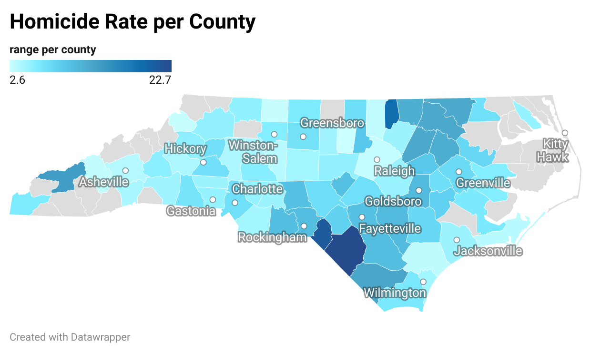

The information gathered here is the instructions on reproducing the data set and the ViolentCrime-HomicideRate-inNorthCarolina.xls is the end result and visible
display for use
. The first set of numbers following the county is th number of Violent crimes and the number after is the homicide rate for that County. 
If there are no numbers, it means there was no homicides recorded for that county that year. 

The two PNG files are visual data to show where the county is located in the state. The darker the county, the more violent crime or more homicides happen there. If the county is blank, no crime happened there. 

